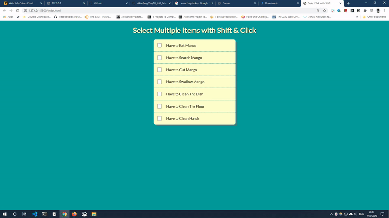

# <h1 align="center"> Hold Shift Key Down to Select Multiple Item</h1>

Check a checkbox and hold the shift key down on another checkbox to select all items in between.

## Live URL
Wanna try it out, I got you covered 😎

Here's the live URL: http://shift-down.surge.sh/

## How To
This is how the app looks like-

First check a checkbox and then check another one holding the shift key down; hoo! all the items in between will be selected

## Tech I Used
This app is purely made with vanilla JavaScript & raw HTML/CSS. It is to demonstrate, if you can be creative you can make something amazing out of those core technologies.

Key topics-
+ **HTML:** I used custom div and checkbox input
+ **CSS:** I used Flexbox to position the items, and other trivial properties to style it.
+ **JS:** I used DOM manipulation technique to get the result.

## Disclaimer
+ This is project is part of javascript challenge by Wes Bos namely JavaScript30. Awesome Challenge! Couldn't recommend it more. https://javascript30.com/
